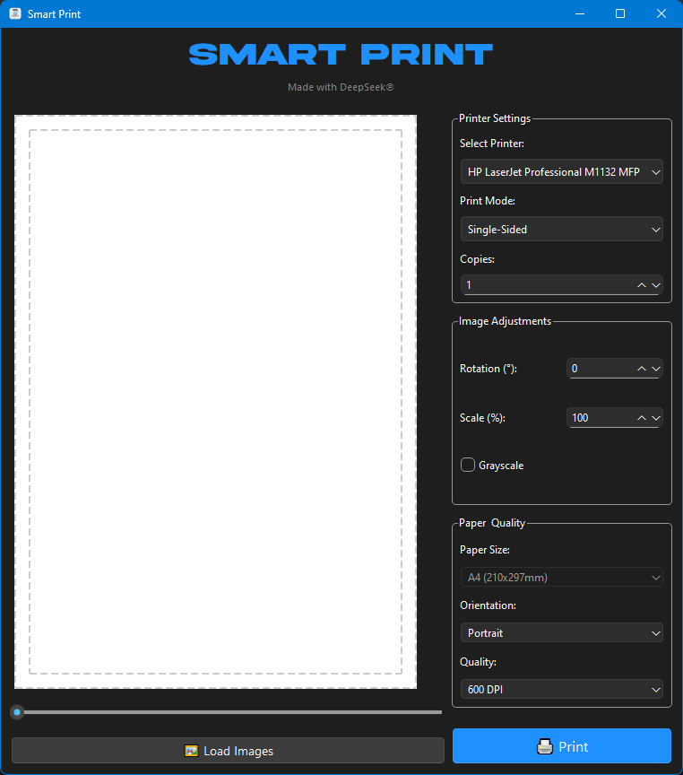
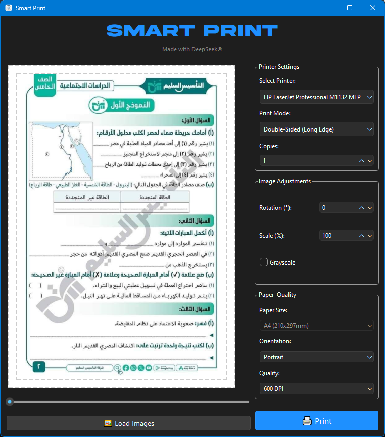
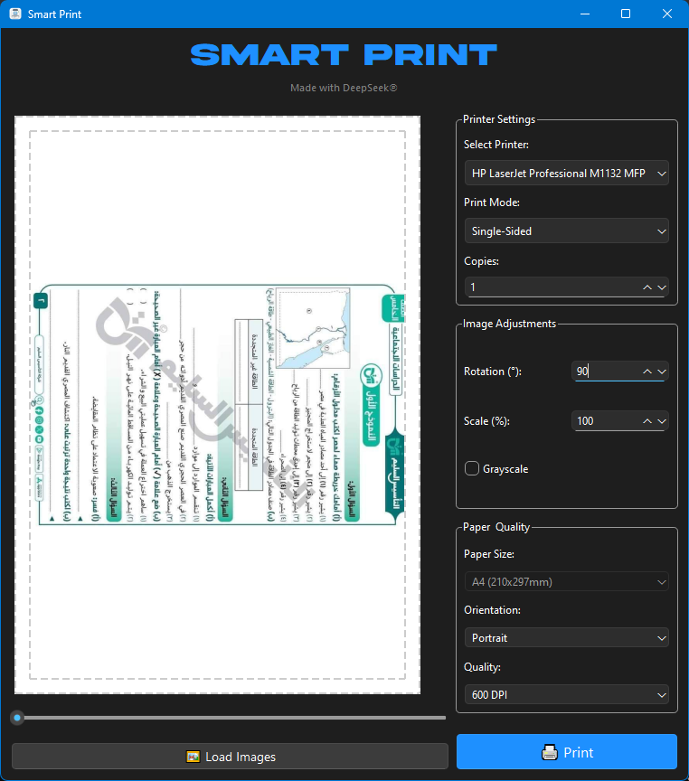

<p align="center">
  
</p>

# 🖨️Smart Print

<div align="center">


**A powerful desktop application for printing images with full control over rotation, scaling, paper size, and single/double-sided printing — all from one clean interface.**

[Features](#-features) • [Installation](#-installation) • [Usage](#-usage) • [Screenshots](#-screenshots) • [Contributing](#-contributing)

</div>

---

## 🌟 Features

### 🖼️ **Image Handling**
- ✅ Load single or multiple images at once
- ✅ Support for common formats (PNG, JPG, JPEG, BMP, TIFF)
- ✅ Live preview of each image before printing
- ✅ Slider to quickly browse through loaded images
- ✅ Independent rotation and scaling per image

### 🔄 **Image Adjustments**
- 🔁 **Independent rotation** for each image (in degrees)
- 📏 **Independent scaling** for each image (10%-100%+)
- ⚫ Grayscale conversion option
- 🎯 Automatic centering within the printable area
- 👀 Real-time adjustment preview

### 🖨️ **Printer Settings**
- 🖥️ Select from any installed system printer
- 📄 **Print modes**:
  - `Single-Sided` - Standard one-sided printing
  - `Double-Sided (Long Edge)` - Duplex printing flipped on the long edge
  - `Double-Sided (Short Edge)` - Duplex printing flipped on the short edge
- 🔢 Adjustable number of copies
- ⚡ Direct printing through the system print spooler

### 📐 **Paper & Quality**
- 📏 Multiple paper size presets (A4, Letter, Legal, A3, and more)
- 🔄 Orientation control: Portrait or Landscape
- 🎚️ Adjustable print quality/resolution (300-1200 DPI)
- 🎯 Automatic content scaling to fit the selected paper size

### 🖥️ **Modern User Interface**
- 🌙 Dark theme with a professional look
- 👀 **Live preview** of the image as it will appear on paper
- 🖱️ Simple drag-and-drop image loading
- 🎚️ Quick-access slider for navigating multiple images
- ⚡ Fast, responsive controls with instant feedback

---

## 📸 Screenshots

<!-- Add screenshots here -->
<!-- Suggested screenshot locations: -->

### Main Interface

*The main application window showing image preview, printer settings, and adjustment controls*

### Image Adjustments

*Rotation, scaling, and grayscale options applied to a loaded image*

### Rotated Page

</br>
*A rotated page that doesn't affect other ones*

---

## 🚀 Installation

### Prerequisites
- Python 3.7 or higher
- Windows (required for native printer integration)
- A configured and installed printer driver

### Method 1: Using pip (Recommended)
```bash
# Clone the repository
git clone https://github.com/yourusername/smart-print.git
cd smart-print

# Install dependencies
pip install -r requirements.txt

# Run the application
python smart_print_customtk.py
```

### Method 2: Manual Installation
```bash
# Install required packages individually
pip install customtkinter
pip install Pillow
pip install pywin32  # for Windows printer integration
```

### Dependencies
```
customtkinter>=5.0.0
Pillow>=9.0.0
pywin32>=305
```

---

## 🎯 Usage

### Quick Start
1. **📁 Load Images**: Click "Load Images" and select one or more images
2. **🔄 Adjust Each Image**: Use the slider to browse images, then set rotation and scale for each one independently
3. **🖨️ Configure Printer**: Select your printer, print mode (single/double-sided), and number of copies
4. **📐 Set Paper & Quality**: Choose paper size, orientation, and DPI
5. **▶️ Print**: Click "Print" to send the job to your printer

### Detailed Settings

#### Image Adjustment Options
| Option | Description | Example |
|--------|--------|-------|
| **Rotation (°)** | Rotate an individual image by a custom angle | `0`, `90`, `180`, `270` |
| **Scale (%)** | Resize an individual image up or down | `50` (half size), `100` (original) |
| **Grayscale** | Convert the image to black and white before printing | Enabled / Disabled |

#### Print Mode Options
| Print Mode | Description |
|---------------|--------|
| `Single-Sided` | Each page is printed on one side only |
| `Double-Sided (Long Edge)` | Pages are printed on both sides, flipped along the long edge |
| `Double-Sided (Short Edge)` | Pages are printed on both sides, flipped along the short edge |

#### Paper & Quality System
- **Paper Size**: Choose from standard presets such as A4 (210x297mm), Letter, Legal, or A3
- **Orientation**: Portrait or Landscape
- **Quality**: Select DPI from 300 up to 1200 for higher print resolution
- **Copies**: Set the number of copies to print for the current job

---

## ⚡ Advanced Features

### 🔄 Live Preview System
The application includes a live preview that updates automatically as you adjust settings:
- Real-time rotation and scaling preview
- Instant grayscale toggle preview
- Automatic fit-to-paper preview
- Quick image navigation via slider

### 🎛️ Per-Image Control
- **Independent Settings**: Each loaded image keeps its own rotation, scale, and grayscale settings
- **Batch Loading**: Load multiple images and adjust them individually before printing
- **Consistent Output**: All adjustments are applied precisely at print time

### 🖨️ Printer Awareness
- **Auto-Detection**: Automatically lists all printers installed on the system
- **Duplex Support**: Detects and respects printer capabilities for double-sided printing
- **Direct Spooling**: Sends print jobs directly through the Windows print system

---

## 🛠️ Technical Details

### Supported Formats
- **Images**: PNG, JPG, JPEG, BMP, TIFF
- **Output**: Sent directly to printer (no intermediate file required)

### Performance
- **Multi-threading**: Non-blocking UI during print job processing
- **Memory Efficiency**: Handles large or multiple images without memory issues
- **High Quality**: Configurable DPI for sharp, professional print results

### Printer Support
- **Native Integration**: Uses the Windows print system via pywin32 for reliable output
- **Duplex Detection**: Automatically adapts options based on printer capabilities
- **Driver Compatibility**: Works with any printer that has a properly installed Windows driver

---

## 🤝 Contributing

We welcome contributions! Here's how you can help:

1. **🍴 Fork** the repository
2. **🌿 Create** a feature branch (`git checkout -b feature/AmazingFeature`)
3. **💾 Commit** your changes (`git commit -m 'Add some AmazingFeature'`)
4. **🚀 Push** to the branch (`git push origin feature/AmazingFeature`)
5. **📬 Open** a pull request

### 🐛 Bug Reports
Please use the [issue tracker](https://github.com/yourusername/smart-print/issues) to report bugs or request features.

---

## 📋 Roadmap

- [ ] **PDF Support**: Print pages directly from PDF files
- [ ] **Batch Presets**: Save and reuse adjustment presets for recurring print jobs
- [ ] **Crop Tool**: Built-in cropping before printing
- [ ] **Print Queue Manager**: View and manage pending print jobs
- [ ] **Mobile App**: Companion app for iOS/Android

---

## 📜 License

This project is licensed under the MIT License - see the [LICENSE](LICENSE) file for details.

---

## 🙏 Acknowledgments & Attribution

- **CustomTkinter** for the modern GUI framework
- **Pillow** for image processing functionality
- **pywin32** for native Windows printer integration

---

<div align="center">

**⭐ Star this repository if you found it useful! ⭐**

[Report a Bug](https://github.com/yourusername/smart-print/issues) • [Request a Feature](https://github.com/yourusername/smart-print/issues) • [Discussions](https://github.com/yourusername/smart-print/discussions)

Made for anyone who needs precise, hassle-free image printing, by [Abu Abdullah](https://github.com/Abuabdellah-Al)

</div>
